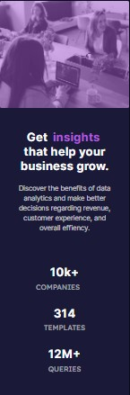

# Responsive stats preview card

This is a project on how to create a responsive frontend stats card using Bootstrap, HTML and CSS gotten from the [Frontend Mentor Community](https://frontendmentor.io)

## Table of contents

- [Responsive stats preview card](#responsive-stats-preview-card)
  - [Table of contents](#table-of-contents)
  - [Overview](#overview)
    - [The challenge](#the-challenge)
    - [Screenshots](#screenshots)
    - [Links](#links)
  - [My process](#my-process)
    - [Built with](#built-with)
    - [What I learned](#what-i-learned)
    - [Useful resources](#useful-resources)
  - [Author](#author)

## Overview

### The challenge

Clients should be able to:

- View the fully responsive site on different screen sizes

### Screenshots

| Laptop/Desktop screen view  | Tablet screen view | Mobile screen view |
|---|---|---|
|  |  |   |   |   |

<br>

### Links

- Solution URL: [Add solution URL here](https://www.frontendmentor.io/solutions/responsive-bootstrap-css-stats-preview-card-pw1W29vpP)
- Live Site URL: [Deployed site on Vercel](https://lokotamathemastermind-stats-preview-card-bootstrap.vercel.app/)

## My process

### Built with

- Semantic HTML5 markup
- CSS custom properties
- Flexbox
- CSS Grid
- Mobile-first workflow
- [Bootstrap](https://getbootstrap.com)

### What I learned

```html
<!-- I learnt how to use row-cols-* -->
<!-- It's a class in bootstrap for sectioning columns and rows for smaller screns and devices -->
<!-- Example: -->

<div class="row-cols-1">
    <div class="col-6"></div>
    <div class="col-6"></div>
</div>

The above sets the column to be even on all devices but stay inside of 1 general row class and not overflow from it!
```

### Useful resources

- [StackOverflow](https://www.stackoverflow.com) - This helped me to get ideas for how to make responsive grids and how to make the color overlay for the image.
- [Bitflow created by me](https://bitflow.vercel.app) - This is what I used to get also an idea of how to mke an image have a color overlay

## Author

- Frontend Mentor - [@LokotamaTheMastermind](https://www.frontendmentor.io/profile/LokotamaTheMastermind)
